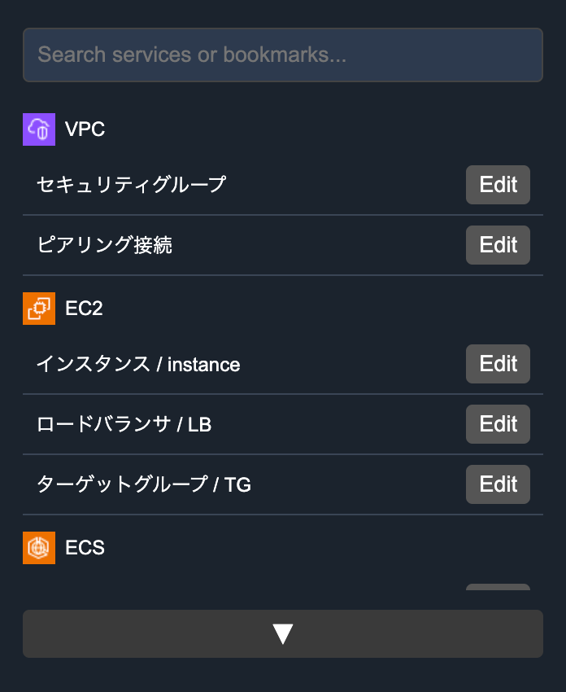

# AWSLinks
AWSLinks for Chrome extentiion

## Installation Steps

### 1. Download the Source Code

- `git clone git@github.com:hoshihaya/AWSLinks.git` or save all the files (manifest.json, background.js, popup.html, popup.js) in a folder (e.g., AWSLinks).

### 2. Open Chrome Extensions Page

- Open Google Chrome and go to chrome://extensions/

### 3. Enable Developer Mode

- Toggle Developer mode on (top-right corner).

### 4. Load the Unpacked Extension

- Click on "Load unpacked" ( `パッケージ化されてない拡張機能を読み込む` ) and select the folder containing the extension files.

### 5. Verify Installation

- The AWSLinks extension should now appear in the Chrome extensions list.

### 6. Open and Configure

- Click on the extension icon in the Chrome toolbar.
- Click "▼" button.
- "Import" from conf/aws-bookmarks.json OR "Add Link" by yourself.

